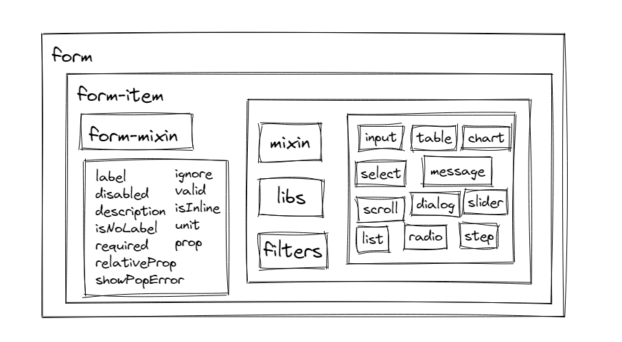

### 框架

<div style="color: #999;text-align: center;padding: 2px;margin-top: -40px;font-size: 12px;">表单组件框架</div>


### 代码结构

```
├─ build # 打包相关文件
├─ demo # 使用文档根目录
├─ dist # 打包后文件，用于上传至npm
├─ docs # 打包后的使用文档根，用于github pages展示
├─ src # 组件库源码
```

### 打包环境

代码目录
```
├─ build # 打包相关文件
|   ├─ md-loader # markdown文件解析
|   |   ├─ index.js # markdown解析主入口文件
|   ├─ components.js # 单个组件对应的js打包入口文件配置
|   ├─ scss.js # 单个组件对应的CSS打包入口配置
|   ├─ webpack.component.js # 单个组件对应的js打包配置
|   ├─ webpack.demo.js # 使用文档打包配置
|   ├─ webpack.publish.js # 所有组件合并打包配置
|   ├─ webpack.scss.js # 单个组件对应的scss打包配置
|   ├─ webpack.theme.full.js # 所有组件CSS合并打包配置
|   ├─ webpack.theme.single.js # 单个组件css打包配置
```


markdown解析原理:

将markdown转成抽象语法树AST，然后解析AST，生成html代码在浏览器中展示，对于自定义的指令进行解析，提取Vue相关代码，以插件的形式注入到页面中，显示为对应的组件。

组件打包:

打包环境分为，组件合并打包、组件单独打包、使用文档打包三块，分别对应不同的配置文件。

组件单独打包一每个组件为入口文件，多入口的形式，同时对每个组件分别进行打包，各组件之间相互独立。

### 组件开发

代码目录如下：
```
├─ src # 组件库源码
|   ├─ components # 各组件源码，核心文件夹
|   |   ├─ xxx文件夹 # 组件源码
|   |   ├─ base.js # 组件公共install配置
|   |   ├─ create-to-body.vue # 弹窗组件
|   |   ├─ ease-function.js # 组件使用到的缓动函数集
|   |   ├─ filters.js # 组件过滤器
|   |   ├─ form-mixins.js # form表单组件公共功能mixin
|   |   ├─ index.js # 全组件入口文件
|   |   ├─ lib.js # 组件工具函数文件
|   |   ├─ translate.js # 内置翻译机制
|   ├─ scss # 各组件样式文件
|   ├─ views # 开发自测试用例文件
|   ├─ router # 开的自测试用例导航配置
|   ├─ App.vue # 用例主页
|   ├─ main.js # 用例入口文件
```

开发步骤：
- 开发前，先确定组件的接口和使用方式，并讨论审核通过
- 风格设计需遵循设计规范
- 在`components`文件夹下添加以组件名命名的文件夹
- 文件夹内天`index.js`和`v-组件名.vue`文件
- 两个文件的编码格式都需要满足编程规范

`index.js`的文件内容如下：

```js
/// Demo为组件名，首字母大写
import Demo from "./demo.vue";

Demo.install = function(Vue) {
  Vue.component(Demo.name, Demo);
};

export default Demo;
```

`组件名.vue`的文件内容格式如下：

```html
<template>
  <div class="mo-xxx">
    ---
  </div>
</template>

<script>
export default {
  name: "mo-xxx",
  props: {
    ---
  }
};
</script>
```

### 使用文档开发

代码目录
```
├─ demo # 使用文档根目录
|   ├─ components # 使用文档相关组件，无需关注
|   ├─ demo-styles # 使用文档相关样式
|   ├─ docs
|   |   ├─ xxx.md # xxx组件使用文档
|   ├─ pages

```
使用文档的格式完全按照Markdowm标准格式去写即可。在原语法的基础上添加了一个自定义的指令用于渲染组件，具体如下：
```
::: demo

```html
<div class="input-group">
  <mo-input type="text" v-model="sizeL" size="L"></mo-input>
</div>
<div class="input-group">
  <mo-input type="text" v-model="sizeM" size="M"></mo-input>
</div>
<div class="input-group">
  <mo-input type="text" v-model="sizeS" size="S"></mo-input>
</div>

<script>
  export default {
    data() {
      return {
        sizeL: "L",
        sizeM: "M",
        sizeS: "S"
      };
    }
  };
</script>
```                                                                   .
:::
```
以`::: demo`开始，以`:::`结束，中间填写合法的`Vue`代码即可正常解析显示。